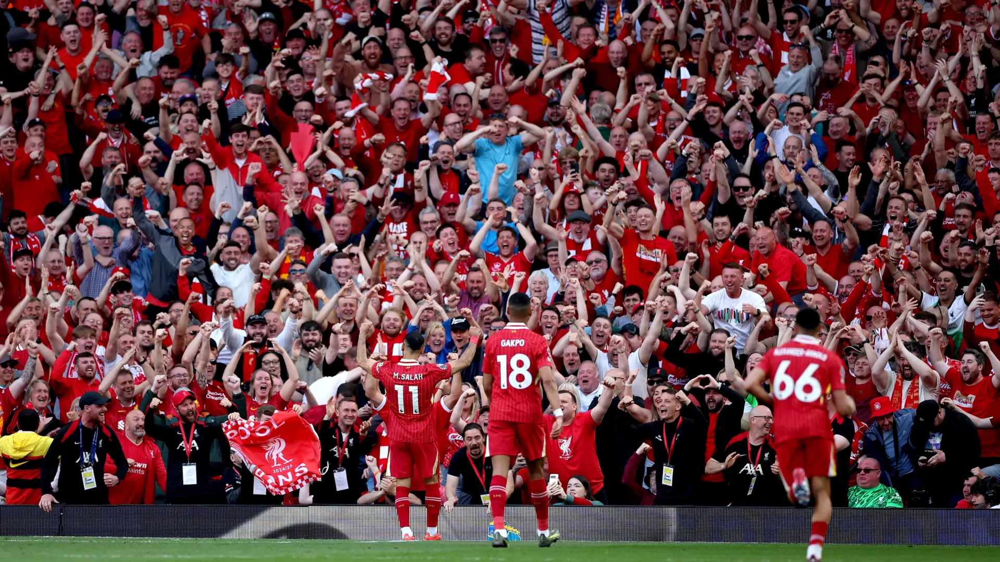
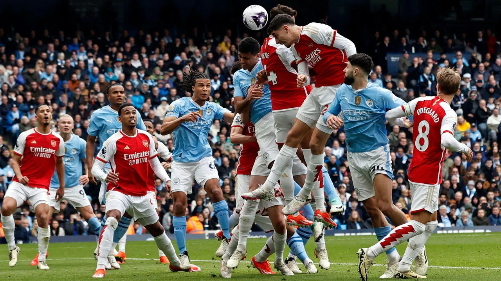

# ⚽ Premier League HUB (SportsDB)

**Alumno:** Jorge Sánchez Gallego  
**Profesor:** Antonio Rosales  
**Escuela/Curso:** Prometeo  
**Asignatura:** Máster FullStack Developer



---

## 🔗 Despliegue (Deploy)

Puedes ver el proyecto funcionando en vivo aquí:
👉 **[THE PREMIER LEAGUE HUB](AQUÍ_PEGA_TU_LINK_DE_VERCEL)**

---

## 📖 Sobre el Proyecto

**Premier League HUB** es una Single Page Application (SPA) desarrollada con **React 19** y **Vite**. La aplicación permite a los aficionados al fútbol inglés consultar equipos, ver plantillas detalladas de jugadores y gestionar una "afiliación virtual" a sus clubes favoritos.

### ⚠️ Nota sobre la API y el Alcance
> *La idea original del proyecto era abarcar múltiples ligas europeas (La Liga, Serie A, Bundesliga, etc.). Sin embargo, debido a las restricciones de la API gratuita utilizada (**TheSportsDB**), que limita el acceso a ciertos endpoints en su versión 'Free Tier', se decidió pivotar y centrar el desarrollo exclusivamente en la **Premier League** para asegurar que todos los datos (equipos, jugadores, escudos) se carguen de manera estable y completa.*

---

## ✅ Cumplimiento de Requisitos Académicos

Este proyecto ha sido diseñado siguiendo estrictamente los requisitos de la evaluación:

### 1. Maquetación y Diseño
* **✅ Web FULL RESPONSIVE:** Implementada con **CSS nativo**, Grid (`grid-template-columns`) y Flexbox. Incluye *breakpoints* para móviles y tablets en `index.css`.
* **Estilo:** Diseño "Dark Mode" moderno con variables CSS (`:root`) para mantener la coherencia visual.

### 2. Arquitectura React
* **✅ Arquitectura útil:** Estructura de carpetas profesional separando responsabilidades:
    * `/pages`: Vistas principales.
    * `/components`: Piezas de UI reutilizables.
    * `/hooks`: Lógica extraída (Custom Hooks).
    * `/context`: Estado global.
* **✅ Routing (3+ páginas):** Navegación fluida con `react-router-dom`:
    1.  **Home (`/`):** Selección de liga.
    2.  **League (`/league/:id`):** Grid de equipos.
    3.  **Team (`/team/:id`):** Detalle, jugadores y formulario.

### 3. Gestión de Estado y Lógica
* **✅ Estados y UseEffect:** Múltiples usos de `useState` para datos, carga y errores. `useEffect` implementado en la llamada a la API con limpieza de memoria (`AbortController`).
* **✅ Custom Hook:** Se ha creado `useFetch.js` para abstraer toda la lógica de conexión a la API y manejo de errores.
* **✅ useContext:** Implementación de `MembershipContext` para gestionar globalmente a qué equipos se ha unido el usuario (persiste entre páginas).

### 4. Formularios y Optimización
* **✅ Formulario Útil:** Formulario de registro de socios utilizando la librería **`react-hook-form`** para validaciones y gestión de envío.
* **✅ Optimización (No Re-renders):** Uso estratégico de `<Link state={...}>` para pasar los datos básicos del equipo desde la vista de Liga a la de Equipo, evitando una petición redundante a la API y logrando una navegación instantánea.

---

## 📂 Estructura del Código

El código ha sido documentado en las secciones críticas para facilitar su comprensión.

```text
src/
├── assets/            # Imágenes y logos
├── components/        # Componentes aislados (MembershipForm, Footer)
├── context/           # Estado Global (Sistema de Socios)
├── hooks/             # useFetch (Lógica de API)
├── pages/             # Vistas (Home, League, Team)
├── App.jsx            # Enrutador principal
└── main.jsx           # Punto de entrada y Providers
```
## 💻 Stack Tecnológico
Core: React 19

Build Tool: Vite

Routing: React Router DOM v7

Forms: React Hook Form

Data: TheSportsDB API (Free Tier)

Styles: CSS3 (Custom Properties & Animations)
Aquí tienes el README.md modificado, eliminando la sección de instalación como me has pedido. Está todo en un único bloque listo para copiar.

Markdown

# ⚽ Premier League HUB (SportsDB)

**Alumno:** Jorge Sánchez Gallego  
**Profesor:** Antonio Rosales  
**Escuela/Curso:** Prometeo  
**Asignatura:** Desarrollo de Aplicaciones Web (ReactJS)



---

## 🔗 Despliegue (Deploy)

Puedes ver el proyecto funcionando en vivo aquí:
👉 **[VER PROYECTO EN VERCEL](AQUÍ_PEGA_TU_LINK_DE_VERCEL)**

---

## 📖 Sobre el Proyecto

**Premier League HUB** es una Single Page Application (SPA) desarrollada con **React 19** y **Vite**. La aplicación permite a los aficionados al fútbol inglés consultar equipos, ver plantillas detalladas de jugadores y gestionar una "afiliación virtual" a sus clubes favoritos.

### ⚠️ Nota sobre la API y el Alcance
> *La idea original del proyecto era abarcar múltiples ligas europeas (La Liga, Serie A, Bundesliga, etc.). Sin embargo, debido a las restricciones de la API gratuita utilizada (**TheSportsDB**), que limita el acceso a ciertos endpoints en su versión 'Free Tier', se decidió pivotar y centrar el desarrollo exclusivamente en la **Premier League** para asegurar que todos los datos (equipos, jugadores, escudos) se carguen de manera estable y completa.*

---

## ✅ Cumplimiento de Requisitos Académicos

Este proyecto ha sido diseñado siguiendo estrictamente los requisitos de la evaluación:

### 1. Maquetación y Diseño
* **✅ Web FULL RESPONSIVE:** Implementada con **CSS nativo**, Grid (`grid-template-columns`) y Flexbox. Incluye *breakpoints* para móviles y tablets en `index.css`.
* **Estilo:** Diseño "Dark Mode" moderno con variables CSS (`:root`) para mantener la coherencia visual.

### 2. Arquitectura React
* **✅ Arquitectura útil:** Estructura de carpetas profesional separando responsabilidades:
    * `/pages`: Vistas principales.
    * `/components`: Piezas de UI reutilizables.
    * `/hooks`: Lógica extraída (Custom Hooks).
    * `/context`: Estado global.
* **✅ Routing (3+ páginas):** Navegación fluida con `react-router-dom`:
    1.  **Home (`/`):** Selección de liga.
    2.  **League (`/league/:id`):** Grid de equipos.
    3.  **Team (`/team/:id`):** Detalle, jugadores y formulario.

### 3. Gestión de Estado y Lógica
* **✅ Estados y UseEffect:** Múltiples usos de `useState` para datos, carga y errores. `useEffect` implementado en la llamada a la API con limpieza de memoria (`AbortController`).
* **✅ Custom Hook:** Se ha creado `useFetch.js` para abstraer toda la lógica de conexión a la API y manejo de errores.
* **✅ useContext:** Implementación de `MembershipContext` para gestionar globalmente a qué equipos se ha unido el usuario (persiste entre páginas).

### 4. Formularios y Optimización
* **✅ Formulario Útil:** Formulario de registro de socios utilizando la librería **`react-hook-form`** para validaciones y gestión de envío.
* **✅ Optimización (No Re-renders):** Uso estratégico de `<Link state={...}>` para pasar los datos básicos del equipo desde la vista de Liga a la de Equipo, evitando una petición redundante a la API y logrando una navegación instantánea.

---

## 📂 Estructura del Código

El código ha sido documentado en las secciones críticas para facilitar su comprensión.

```text
src/
├── assets/            # Imágenes y logos
├── components/        # Componentes aislados (MembershipForm, Footer)
├── context/           # Estado Global (Sistema de Socios)
├── hooks/             # useFetch (Lógica de API)
├── pages/             # Vistas (Home, League, Team)
├── App.jsx            # Enrutador principal
└── main.jsx           # Punto de entrada y Providers
```
## 💻 Stack Tecnológico
Core: React 19

Build Tool: Vite

Routing: React Router DOM v7

Forms: React Hook Form

Data: TheSportsDB API (Free Tier)

Styles: CSS3 (Custom Properties & Animations)

## Desarrollado por Jorge Sánchez Gallego.